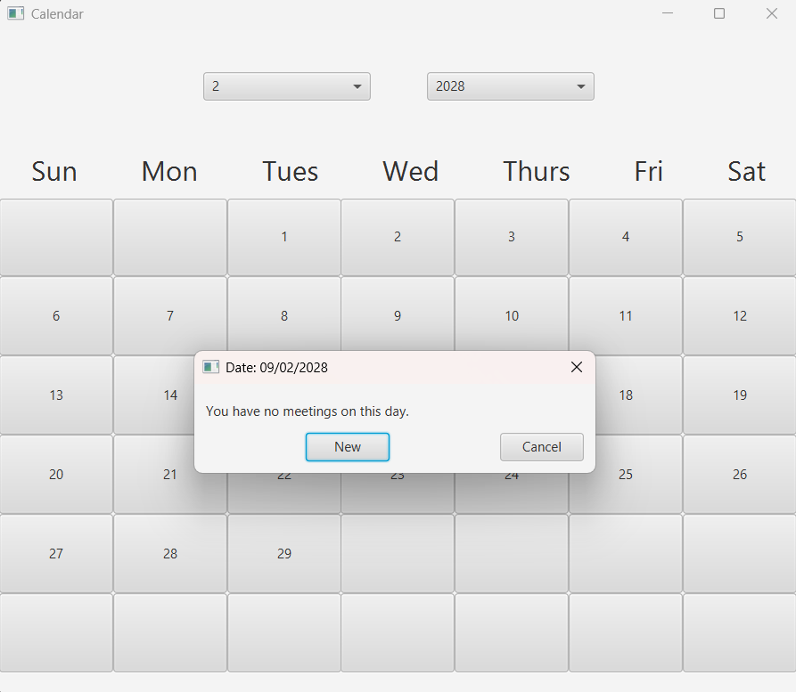

# JavaFX Calendar

A lightweight desktop calendar application built with Java, JavaFX, FXML, and Maven. Users can select a month and year, view the calendar, and create or edit meeting notes for individual dates.

<p>
  
</p>

## Features

- Monthly calendar view.
- Month and year selection.
- Create and edit meeting notes for selected dates.
- Simple JavaFX/FXML user interface.
- Maven Wrapper included for reproducible project setup.

## Technology

- Java 21
- JavaFX 21
- Maven Wrapper 3.3.4

## Requirements

- JDK 21 or newer
- A desktop environment capable of running JavaFX

You do not need to install Maven or the JavaFX SDK separately.

## Run on Windows

From the repository root:

```powershell
.\mvnw.cmd javafx:run
```

## Run on macOS / Linux

From the repository root:

```bash
./mvnw javafx:run
```

The Maven Wrapper downloads Maven automatically the first time it is used.

## How to Use

1. Select a month.
2. Select a year.
3. Click a day in the calendar.
4. Create a new meeting note or edit an existing one.

Meeting data is kept in memory while the application is running; it is not persisted to disk.

## Project Structure

```text
Calendar/
├── .mvn/
│   └── wrapper/
├── src/
│   └── main/
│       ├── java/
│       │   ├── CalendarMain.java
│       │   ├── CalendarController.java
│       │   └── Logic.java
│       └── resources/
│           └── Calendar.fxml
├── .gitignore
├── mvnw
├── mvnw.cmd
├── pom.xml
└── README.md
```
